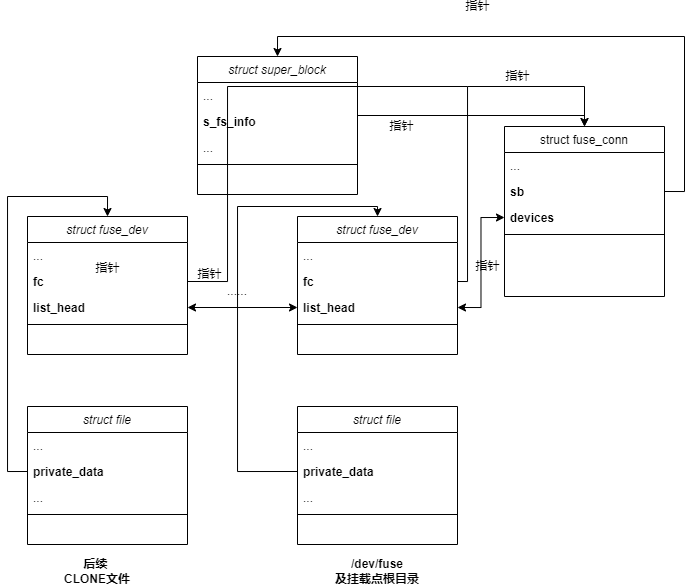

# 总览

fuse 内核态位于 fs/fuse 文件夹下，主要有 dev.c dir.c file.c inode.c control.c xattr.c acl.c readdir.c ioctl.c 文件组成，包含一个可选的 dax.c 文件；

cuse 内核态由 cuse.c 文件组成；

virtiofs 内核态由 virtio_fs.c 文件组成；

# Linux 内核数据结构

## 等待队列
```c
/*
 * A single wait-queue entry structure:
 */
struct wait_queue_entry {
	unsigned int		flags;
	void			*private;
	wait_queue_func_t	func;
	struct list_head	entry;
};

struct wait_queue_head {
	spinlock_t		lock;
	struct list_head	head;
};
typedef struct wait_queue_head wait_queue_head_t;
```

它与进程调度机制相关，使用等待队列实现阻塞进程的唤醒。

## 请求体
```c
/**
 * A request to the client
 *
 * .waitq.lock protects the following fields:
 *   - FR_ABORTED
 *   - FR_LOCKED (may also be modified under fc->lock, tested under both)
 */
struct fuse_req {
	/** This can be on either pending processing or io lists in
	    fuse_conn */
	struct list_head list;

	/** Entry on the interrupts list  */
	struct list_head intr_entry;

	/* Input/output arguments */
	struct fuse_args *args;

	/** refcount */
	refcount_t count;

	/* Request flags, updated with test/set/clear_bit() */
	unsigned long flags;

	/* The request input header */
	struct {
		struct fuse_in_header h;
	} in;

	/* The request output header */
	struct {
		struct fuse_out_header h;
	} out;

	/** Used to wake up the task waiting for completion of request*/
	wait_queue_head_t waitq;

#if IS_ENABLED(CONFIG_VIRTIO_FS)
	/** virtio-fs's physically contiguous buffer for in and out args */
	void *argbuf;
#endif

	/** fuse_mount this request belongs to */
	struct fuse_mount *fm;
};
```

其中，通过 list 字段将请求链接到 fuse_iqueue->pending/fuse_pqueue->processing/fuse_pqueue->io 中，形成链表；通过 intr_entry 将请求连接到队列 fuse_iqueue->interrupts 中，形成链表。

## 输入队列
```c
struct fuse_iqueue {
	/** Connection established */
	unsigned connected;

	/** Lock protecting accesses to members of this structure */
	spinlock_t lock;

	/** Readers of the connection are waiting on this */
	wait_queue_head_t waitq;

	/** The next unique request id */
	u64 reqctr;

	/** The list of pending requests */
	struct list_head pending;

	/** Pending interrupts */
	struct list_head interrupts;

	/** Queue of pending forgets */
	struct fuse_forget_link forget_list_head;
	struct fuse_forget_link *forget_list_tail;

	/** Batching of FORGET requests (positive indicates FORGET batch) */
	int forget_batch;

	/** O_ASYNC requests */
	struct fasync_struct *fasync;

	/** Device-specific callbacks */
	const struct fuse_iqueue_ops *ops;

	/** Device-specific state */
	void *priv;
};
```
管理当前在内核中等待还未传递给用户空间处理的请求。其中 waitq 是等待队列（应该是发起 VFS 文件系统调用等待完成的用户），pending 和 interrupts 分别是两个请求队列，以及 forget_list_head 是一个 forget 请求队列， forget_list_tail 是指向 forget 请求队列最后一个元素的指针。

## 处理队列

管理需要等待用户空间处理完成的请求（正在处理中）

```c
struct fuse_pqueue {
	/** Connection established */
	unsigned connected;

	/** Lock protecting accessess to  members of this structure */
	spinlock_t lock;

	/** Hash table of requests being processed */
	struct list_head *processing;

	/** The list of requests under I/O */
	struct list_head io;
};
```
其中 io 为当前正在传送到用户空间的请求，processing 为根据哈希组织的请求列表（计算一个哈希值，然后相同哈希值的形成一个链表）。

## fuse_dev
```c
/**
 * Fuse device instance
 */
struct fuse_dev {
	/** Fuse connection for this device */
	struct fuse_conn *fc;

	/** Processing queue */
	struct fuse_pqueue pq;

	/** list entry on fc->devices */
	struct list_head entry;
};
```
挂载一个文件系统以及后续通过 FUSE_DEV_IOC_CLONE 都会生成一个 fuse_dev 实例。它们中的 fc 字段指向它们所在的连接，每个 fuse_dev 都会又自己的处理队列 pq，通过 entry 字段将 fuse_dev 加入的 fc->devices 形成的链表当中。

## fuse_conn
A Fuse connection. This structure is created, when the filesystem is mounted, and isdestroyed, when the client device is closed and the filesystem is unmounted. fuse_conn 中包含了与用户守护进程协商过后的信息。另外其中的 devices 字段管理保存了当前连接下所有的 fuse_dev 形成链表。

# dev.c

这个文件定义了对字符串设备文件 /dev/fuse 的操作，如打开、读取这个fuse文件之类的；这是一个混杂设备，对该文件的读取等操作所返回的都是它们保存在内存中的数据结构，虽然系统中只有一个 /dev/fuse 文件，但是每个进程对这个文件调用 open 所看到的 file 都是不同的。

/dev/fuse 的文件对象中 private_data 字段保存对应 struct fuse_dev 在内存中的地址
```c
file->private_data=(struct fuse_dev *)fud
```

对应该文件的操作如下：
```c
const struct file_operations fuse_dev_operations = {
	.owner		= THIS_MODULE,
	.open		= fuse_dev_open,
	.llseek		= no_llseek,
	.read_iter	= fuse_dev_read,
	.splice_read	= fuse_dev_splice_read,
	.write_iter	= fuse_dev_write,
	.splice_write	= fuse_dev_splice_write,
	.poll		= fuse_dev_poll,
	.release	= fuse_dev_release,
	.fasync		= fuse_dev_fasync,
	.unlocked_ioctl = fuse_dev_ioctl,
	.compat_ioctl   = compat_ptr_ioctl,
};
EXPORT_SYMBOL_GPL(fuse_dev_operations);
```

## open
fuse_dev_open 会将对应 file->private_data 设置为 NULL，后续在挂载完成之后会将其设置为 fuse_dev 的内存地址。

## read_iter
fuse_dev_do_read

Read a single request into the userspace filesystem's buffer. This function waits until a request is available, then removes it from the pending list and copies request data to userspace buffer. If no reply is needed (FORGET) or request has been aborted or there was an error during the copying then it's finished by calling fuse_request_end(). Otherwise add it to the processing list, and set the 'sent' flag.

## write_iter
fuse_dev_do_write

Write a single reply to a request. First the header is copied from the write buffer. The request is then searched on the processing list by the unique ID found in the header. If found, then remove it from the list and copy the rest of the buffer to the request. The request is finished by calling fuse_request_end().

## 用户空间 VFS 请求
`fuse_simple_notify_reply` 将用户的请求放入请求队列，应该还有 `fuse_request_queue_background` 之类的。

# inode.c

主要记录了用户态文件系统挂载点超级块的相关信息

## 初始化

整个文件系统的初始化以及销毁过程定义在 inode.c 当中，这会创建一个名为 fuse 的文件系统，后续可以在目录下挂载 fuse 文件系统：
```c
static int __init fuse_init(void)
{
	int res;

	pr_info("init (API version %i.%i)\n",
		FUSE_KERNEL_VERSION, FUSE_KERNEL_MINOR_VERSION);

	INIT_LIST_HEAD(&fuse_conn_list);

	// 注册一个fuse文件系统
	res = fuse_fs_init();
	if (res)
		goto err;

	// 设备文件/dev/fuse初始化
	res = fuse_dev_init();
	if (res)
		goto err_fs_cleanup;

	// sysfs初始化
	res = fuse_sysfs_init();
	if (res)
		goto err_dev_cleanup;

	// fusectl初始化
	res = fuse_ctl_init();
	if (res)
		goto err_sysfs_cleanup;

	sanitize_global_limit(&max_user_bgreq);
	sanitize_global_limit(&max_user_congthresh);

	return 0;

 err_sysfs_cleanup:
	fuse_sysfs_cleanup();
 err_dev_cleanup:
	fuse_dev_cleanup();
 err_fs_cleanup:
	fuse_fs_cleanup();
 err:
	return res;
}

static void __exit fuse_exit(void)
{
	pr_debug("exit\n");

	fuse_ctl_cleanup();
	fuse_sysfs_cleanup();
	fuse_fs_cleanup();
	fuse_dev_cleanup();
}

module_init(fuse_init);
module_exit(fuse_exit);
```

## 填充超级块
fuse_fill_super 在文件系统被挂载时对超级块进行初始化，其中会将 super_block->s_fs_info 字段设置为对应的 fuse_conn, fuse_conn 中的 sb 字段又会指向当前 super_block. 超级块文件 file 的 private字段也记录了对应的 fuse_dev 信息。

## 其他
这个文件中定义了一个全局的 fuse_conn_list，管理所有的 fuse_conn，所有挂载的 fuse 文件系统。

# 总结
最终，各个数据结构之间的关系如下：

