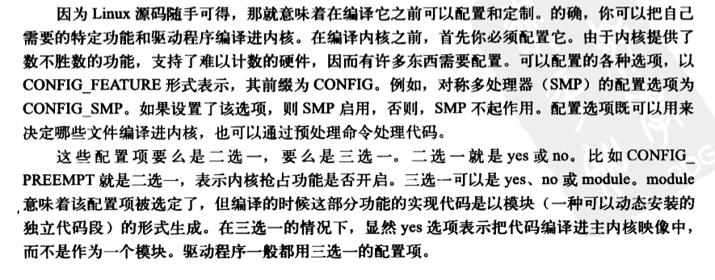

# 内核源码

/usr/src/linux-headers-<内核版本>/ 存放的是 linux 开发的头文件，/usr/src/linux-headers-<内核版本>-generic/ 目录下的文件均是指向 /usr/src/linux-headers-<内核版本>/ 目录下对应文件的软连接，以及 /lib/modules/<内核版本>-generic/build 是指向 /usr/src/linux-headers-<内核版本>-generic/ 的软连接。

目录 /lib/modules/<内核版本>-generic/kernel 包含模块 ko 文件；

内核源码需要通过 `sudo apt install linux-source-$(uname -r)` 下载相应的版本，下载完之后会再 /usr/src/ 目录下有对应的源码：


# 编译配置




某些功能可以编译进内核，也可以不编译进内核，也可以单独编译成模块（模块可以动态安装）。

Ubuntu 下配置需要安装相关的依赖环境：

```bash
sudo apt install bison flex libssl-dev libelf-dev 
```

menuconfig 还需要安装库：

```bash
sudo apt install libncurses-dev
```

之后运行 `make menuconfig` 在界面下进行配置生成 .config 文件

也可以从/boot/config-5.4.0-122-generic拷贝到当前项目的根目录下，手动对.config文件进行修改：

```bash
cp /boot/config-5.4.0-122-generic ./.config
```

# 编译与安装内核

N个线程编译（内核以及模块）：

```bash
make -jN
```

编译内核（压缩的内核镜像)：

```bash
make bzImage
```

编译模块：

```bash
make modules
```

单独编译某个模块

```bash
make modules M=./fs/fuse
```

安装内核模块：

```bash
sudo make modules_install M=./fs/fuse
```

安装内核镜像：
```bash
sudo make install 
```

## 更新grub
启用内核作为引导，并更新一下grub，之后重启即可在启动界面选择需要启动的内核
```bash
sudo mkinitramfs -ko initrd.img-5.4.192 5.4.192
sudo update-grub
```