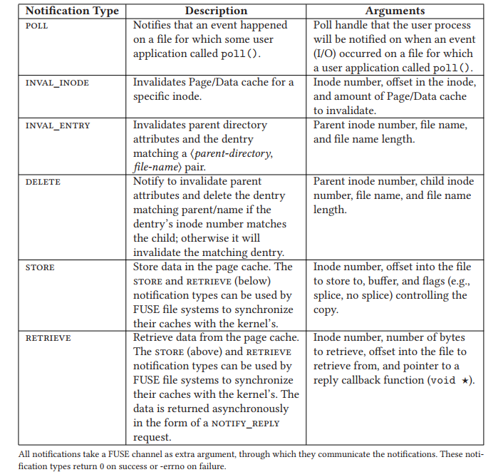

# 总览
所有请求的预处理函数在 `fuse_operation.c` 中实现，预处理函数则会调用真正的实现用户态空间文件系统的函数来处理请求（如果有的话），预处理函数只是对一些参数进行简单地设置以及转换。用户需要实现用户态空间文件系统的具体函数，它的接口定义在 `fuse_operation.h` 文件。
# FUSE 请求类型
FUSE Request Types Grouped by Semantics:
|Group (#) 				    | Request Types|
|----                       | ----         |
|Special (3) 				| **init**, **destroy**, **interrupt**|
|Metadata (14) 			    | lookup, forget, batch_forget, create, unlink, link, rename, rename2, open, release, statfs, fsync, flush, access|
|Data (2) 				    | read, write|
|Attributes (2) 			| getattr, setattr|
|Extended Attributes (4)    | setxattr, getxattr, listxattr, removexattr|
|Symlinks (2) 			    | symlink, readlink|
|Directory (7) 			    | mkdir, rmdir, opendir, releasedir, readdir, readdirplus, fsyncdir|
|Locking (3) 				| getlk, setlk, setlkw|
|Misc (6) 				    | bmap, fallocate, mknod, ioctl, poll, notify_reply|

## INIT
当文件系统被挂载时，内核将会产生 INIT 请求，通过这个请求，它们（内核与用户空间进程）对以下内容进行协商：
1. FUSE 所使用的协议版本号
2. 内核所支持的能力 capabilities 以及用户空间进程所需要内核支持的能力 capabilities
3. 其他参数设定（max_write, max_readahead, time_gran）

在我们的实现中，我们的用户空间守护进程暂时不需要内核有任何能力。

## DESTROY
当文件系统被解除挂载时，内核将会产生 DESTROY 请求，用户空间进程在收到这个请求后，并不会做太多的事情。如果守护进程定义了对这个请求的处理函数的话，那么它一般会进行一些必要的清理工作。这个请求将会阻塞解挂的进程直到内核收到用户空间进程的响应。**这个请求似乎只有在 fuseblk 文件系统解挂时才会产生，普通的 fuse 不会有这个请求**

## INTERRUPT
当之前传送给用户空间进程的请求不再被需要时，将会产生一个 INTERRUPT 请求。比如，当一个用户被阻塞在读取文件过程中时，取消这个操作。这个请求具有最高优先级，将会首先被内核发往用户空间进程。用户空间进程可以完全忽略这个请求或者发送一个回复并将错误设置成 EINTR (it may honor them by sending a reply to the original request, with the error set to EINTR).

在我们的实现中，如果收到了 INTERRUPT 请求，有两种情况：
1. 如果在这之前已经收到了对应要被取消的请求，那么设置这个请求的 interrupted 为 1；
    i). 如果这个请求已经正在被处理，那么不做任何事；
    ii). 如果这个请求尚未被处理，那么从 req_list 中移除这个请求；
2. 如果在这之前没有收到对应要被取消的请求，那么将这个 INTERRUPT 请求加入到 int_list，后续如果收到对应的请求，那么直接忽略；

上述 1 中的过程通过 req->used 实现，一个请求在收到对应 INTERRUPT 请求之后，要么进入该请求的正常处理过程（执行这个请求并响应），要么进入该请求的打断过程（直接删除这个请求），我们通过类似 test_and_set() 的方法来实现这个过程。

## LOOKUP && FORGET && BATCH_FORGET
路径名到 inode 的转换由 LOOKUP 请求完成，FUSE 根目录 inode 号始终为 1. 每当一个已经存在的 inode 被找到（或是被创建），内核将会把这个 inode 保存在 dcache. 每当需要从 dcache 中移除一个 inode 时，内核发送 FORGET 请求到守护进程。FUSE inode 的引用计数在每次收到 LOOKUP, create 请求时增加 1，FORGET 请求传递一个 nlookups 参数通知文件系统将要减少的引用次数。当守护进程中对应的引用计数减到 0 时，守护进程可以决定释放响应数据结构分配的内存。这个请求运行内核在单个请求当中 forget 多个 inode 节点。

## OPEN && FLUSH && RELEASE
OPEN 请求当用户打开一个文件的时候产生，FLUSH 请求在一个打开文件被关闭的时候，RELEASE 则在没有对之前打开文件的引用时产生（关闭对应的文件描述符）。一个 RELEASE 请求对应一个 OPEN 请求，但是每个 OPEN 请求可以对应多个 FLUSH 请求（由于 forks, dups 等原因）。

## OPENDIR && RELEASEDIR
它们的作用类似于 OPEN 和 RELEASE. 

## READDIR && READDIRPLUS
READDIR 请求返回一个或多个项，READDIRPLUS 请求还会额外包含每个项的元数据。

## ACCESS
ACCESS 请求会在以下两种情况产生：access(2) 和 chdir(2). 在其他情况下，对某个文件的访问许可会在实际的操作执行过程中进行（如 MKDIR 请求被守护进程收到之后，守护进程会返回 EACESS 如果这个操作不被许可的话）。用户空间文件系统可以对这个请求的处理进行定制。一般情况下，用户通过 default_permissions 选项挂载文件系统允许内核基于标准的 Unix 属性（ownership and permission bits）来授权或禁止访问，在这种情况下，将不会产生 ACCESS 请求。

## FSYNC && FSYNCDIR
这两个请求被用来同步文件和目录上的数据和元数据到磁盘。这两个请求有一个额外的标志 datasync，当这个标志被设置时，它仅仅同步文件数据到磁盘（不包含元数据）。

## GETLK && SETLKW && SETLK
GETLK 检查检查一个文件是否已经上锁，但是不会对文件进行上锁；SETLKW 获取一个指定的锁，如果锁已经被其他人占有，那么就会阻塞直到锁被释放；SETLK 类似于 SETLKW，但是它在锁被占有时不会阻塞，而是返回一个错误。

# 通知机制
通常都是由 FUSE 内核主动发起请求，然后用户空间进程进行相应。但用户空间进程同样也可以在没有收到任何请求的情况下，主动通知内核。如一个用户应用通过 poll 等待文件描述符可用，当文件描述符可用时，用户空间守护进程通过主动通知内核从而唤醒等待的进程。总共有 6 中通知类型，除了 retrieve 这个类型之外，其余通知都是同步的（等待内核返回值，返回 0 表示成功，返回负数表示失败）。retrieve 这个类型的通知，需要等待内核后续通过一个 notify_reply 请求进行响应。

